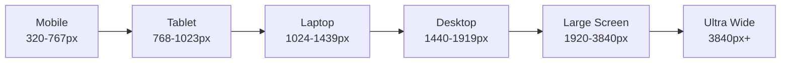
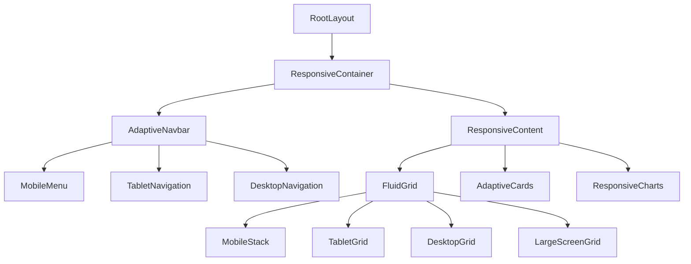
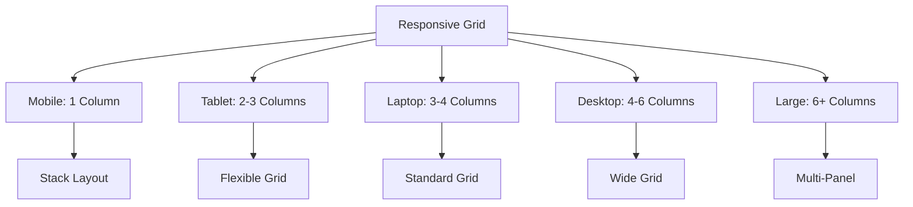
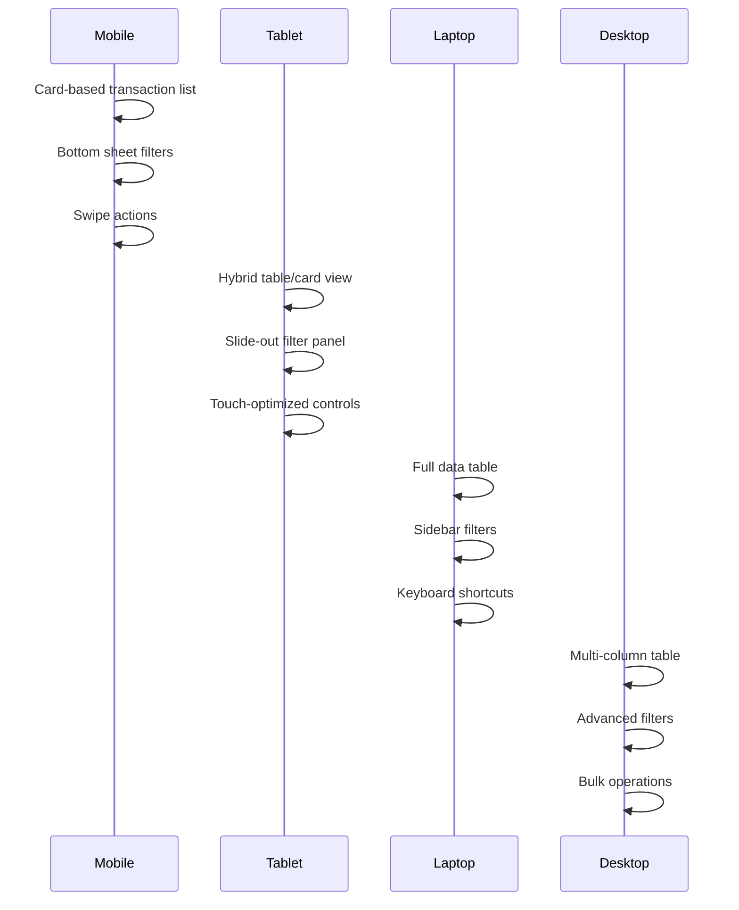
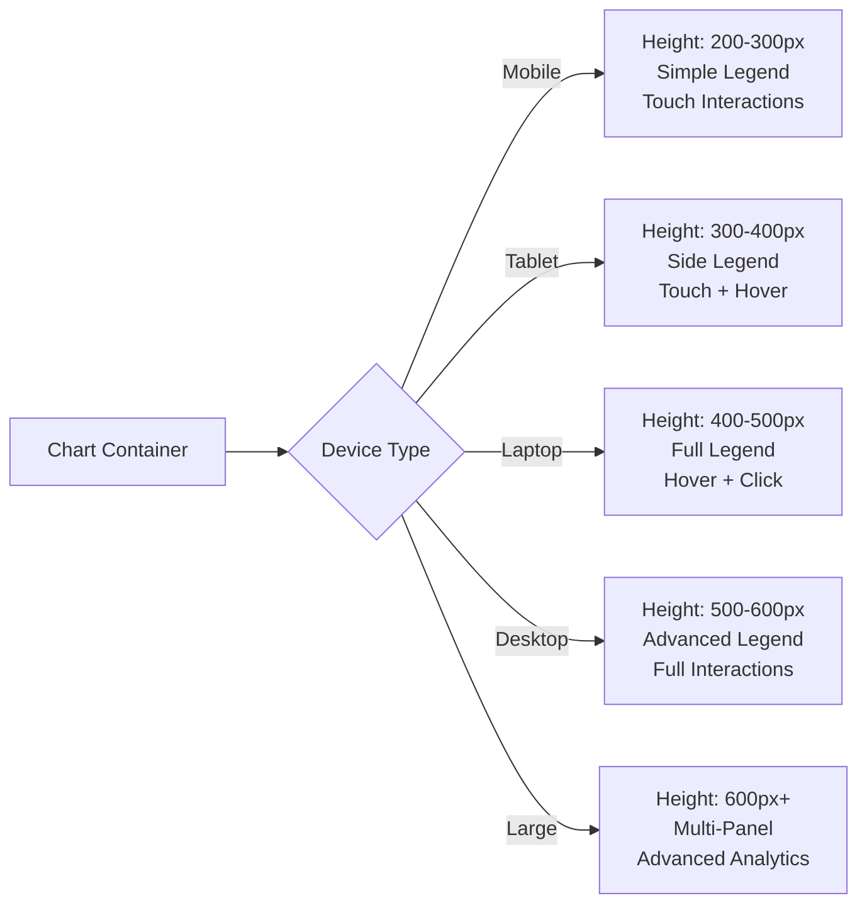
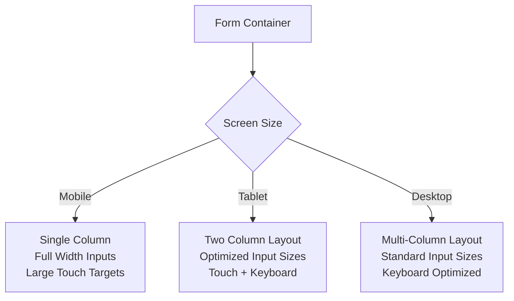

# Responsive Design Enhancement: Multi-Device Support

## Overview

This design document outlines a comprehensive responsive enhancement strategy for the ExpenseBuddy AI application to ensure optimal user experience across all devices from mobile phones to 43-inch displays. The current application uses Tailwind CSS with basic responsive classes but requires systematic enhancement for better multi-device support.

## Current State Analysis

The application currently has:
- Basic Tailwind CSS responsive utilities
- Limited mobile breakpoint handling (768px)
- Inconsistent component responsiveness
- Hero UI components with built-in responsive behavior
- Some components using `useMediaQuery` hook for conditional rendering

## Technology Stack

- **Frontend Framework**: Next.js 15 with React 19
- **Styling**: Tailwind CSS 3.4.17 with Hero UI
- **Component Library**: Radix UI primitives with custom styling
- **State Management**: React hooks and context
- **Responsive Utilities**: Custom `useIsMobile` and `useMediaQuery` hooks

## Enhanced Responsive Breakpoint Strategy

### Breakpoint System



### Tailwind Configuration Enhancement

```javascript
// Enhanced breakpoints for tailwind.config.ts
screens: {
  'xs': '320px',      // Extra small devices
  'sm': '640px',      // Small devices (landscape phones)
  'md': '768px',      // Medium devices (tablets)
  'lg': '1024px',     // Large devices (laptops)
  'xl': '1280px',     // Extra large devices (desktops)
  '2xl': '1536px',    // 2X large devices
  '3xl': '1920px',    // Large monitors
  '4xl': '2560px',    // Ultra-wide monitors
  '5xl': '3840px',    // 4K+ displays
}
```

## Component Responsive Architecture

### Layout System Enhancements



### Navigation Component Enhancements

#### Mobile Navigation (320px - 767px)
- Hamburger menu with full-screen overlay
- Bottom tab navigation for primary actions
- Collapsible sections in navigation drawer
- Touch-optimized button sizes (minimum 44px)

#### Tablet Navigation (768px - 1023px)
- Sidebar navigation with toggle capability
- Horizontal tab bar for secondary navigation
- Contextual action buttons
- Optimized for both portrait and landscape

#### Desktop Navigation (1024px+)
- Persistent sidebar navigation
- Top navigation bar with breadcrumbs
- Multi-level dropdown menus
- Keyboard navigation support

#### Large Screen Navigation (1920px+)
- Multi-panel layout support
- Secondary navigation panels
- Advanced filtering and search interfaces
- Dashboard-style navigation

### Grid System Enhancements



## Page-Specific Responsive Enhancements

### Dashboard Page

#### Mobile Layout (xs, sm)
- Single column card stack
- Horizontal scrolling for summary cards
- Collapsible sections for transaction table
- Simplified quick actions with drawer

#### Tablet Layout (md)
- Two-column grid for summary cards
- Horizontal layout for quick actions
- Condensed transaction table with horizontal scroll
- Floating action button for new transaction

#### Laptop Layout (lg, xl)
- Three-column grid layout
- Full transaction table with all columns
- Sidebar with secondary information
- Multiple quick action rows

#### Large Screen Layout (2xl+)
- Multi-panel dashboard layout
- Real-time widgets and charts
- Advanced data visualization
- Multiple data streams in separate panels

### Transactions Page

#### Component Responsive Behavior


### Reports Page

#### Chart Responsiveness
- Mobile: Single chart per view with horizontal scrolling
- Tablet: Two charts per row with responsive scaling
- Laptop: Multiple charts in dashboard layout
- Large Screen: Multi-panel analytics with real-time updates

### Budget Management

#### Responsive Behavior
- Mobile: Vertical budget cards with progress bars
- Tablet: Grid layout with category allocations
- Laptop: Split view with budget vs. actual
- Large Screen: Advanced budget analytics dashboard

## Chart and Data Visualization Responsive Strategy

### Chart Scaling Rules



### Data Table Responsive Patterns

#### Mobile Pattern
- Card-based layout with expandable details
- Essential information only
- Swipe gestures for actions
- Infinite scroll pagination

#### Tablet Pattern
- Hybrid table/card view
- Collapsible columns
- Touch-optimized controls
- Page-based pagination

#### Desktop Pattern
- Full data table with all columns
- Column sorting and filtering
- Bulk selection capabilities
- Advanced pagination controls

## Component Library Enhancements

### Responsive Container Component

```typescript
interface ResponsiveContainerProps {
  children: React.ReactNode
  className?: string
  maxWidth?: 'sm' | 'md' | 'lg' | 'xl' | '2xl' | '4xl' | 'full'
  padding?: 'none' | 'sm' | 'md' | 'lg' | 'xl'
}
```

### Adaptive Grid Component

```typescript
interface AdaptiveGridProps {
  children: React.ReactNode
  columns: {
    xs?: number
    sm?: number
    md?: number
    lg?: number
    xl?: number
    '2xl'?: number
  }
  gap?: string
  className?: string
}
```

### Responsive Card Component

```typescript
interface ResponsiveCardProps extends CardProps {
  responsive?: {
    mobile?: 'compact' | 'standard'
    tablet?: 'compact' | 'standard' | 'expanded'
    desktop?: 'standard' | 'expanded' | 'detailed'
  }
}
```

## Form and Input Responsive Enhancements

### Form Layout Patterns



### Input Component Enhancements
- Mobile: Larger touch targets (44px minimum)
- Tablet: Medium-sized inputs with touch optimization
- Desktop: Standard inputs with keyboard shortcuts
- Large Screen: Compact inputs with advanced features

## Performance Considerations

### Image and Asset Optimization
- Responsive images with multiple breakpoints
- WebP format with fallbacks
- Lazy loading for non-critical images
- CDN optimization for large screens

### JavaScript Bundle Optimization
- Code splitting by device type
- Lazy loading of desktop-only features
- Mobile-first JavaScript delivery
- Progressive enhancement strategy

### CSS Optimization
- Critical CSS extraction
- Unused CSS purging
- Media query optimization
- CSS-in-JS performance tuning

## Testing Strategy

### Device Testing Matrix

| Device Category | Screen Sizes | Test Scenarios |
|----------------|--------------|----------------|
| Mobile | 320px - 767px | Touch interactions, portrait/landscape |
| Tablet | 768px - 1023px | Hybrid interactions, orientation changes |
| Laptop | 1024px - 1439px | Keyboard navigation, window resizing |
| Desktop | 1440px - 1919px | Multi-window, accessibility |
| Large Screen | 1920px+ | Multi-panel, advanced features |

### Responsive Testing Tools
- Browser DevTools responsive mode
- Physical device testing
- Automated responsive testing
- Performance monitoring across devices

## Implementation Phases

### Phase 1: Foundation (Week 1-2)
- Enhanced Tailwind configuration
- Core responsive components
- Navigation system updates
- Basic grid enhancements

### Phase 2: Page Optimization (Week 3-4)
- Dashboard responsive enhancements
- Transaction page improvements
- Reports page optimization
- Form responsiveness

### Phase 3: Advanced Features (Week 5-6)
- Chart responsive behavior
- Advanced data table patterns
- Large screen optimizations
- Performance tuning

### Phase 4: Testing & Polish (Week 7-8)
- Cross-device testing
- Performance optimization
- Accessibility improvements
- Final responsive adjustments

## Accessibility Considerations

### Responsive Accessibility
- Touch target sizes (44px minimum)
- Keyboard navigation across all breakpoints
- Screen reader compatibility
- High contrast mode support
- Reduced motion preferences

### Focus Management
- Logical tab order across layouts
- Skip links for navigation
- Focus indicators for all interactive elements
- ARIA labels for responsive components

## Browser Support

### Target Browsers
- Chrome 90+
- Firefox 88+
- Safari 14+
- Edge 90+
- Mobile Safari iOS 14+
- Chrome Mobile Android 90+

### Fallback Strategy
- Progressive enhancement approach
- Graceful degradation for older browsers
- Feature detection over browser detection
- Polyfills for critical features- Top navigation bar with breadcrumbs
- Multi-level dropdown menus
- Keyboard navigation support

#### Large Screen Navigation (1920px+)
- Multi-panel layout support
- Secondary navigation panels
- Advanced filtering and search interfaces
- Dashboard-style navigation

### Grid System Enhancements


## Page-Specific Responsive Enhancements

### Dashboard Page

#### Mobile Layout (xs, sm)
- Single column card stack
- Horizontal scrolling for summary cards
- Collapsible sections for transaction table
- Simplified quick actions with drawer

#### Tablet Layout (md)
- Two-column grid for summary cards
- Horizontal layout for quick actions
- Condensed transaction table with horizontal scroll
- Floating action button for new transaction

#### Laptop Layout (lg, xl)
- Three-column grid layout
- Full transaction table with all columns
- Sidebar with secondary information
- Multiple quick action rows

#### Large Screen Layout (2xl+)
- Multi-panel dashboard layout
- Real-time widgets and charts
- Advanced data visualization
- Multiple data streams in separate panels

### Transactions Page

#### Component Responsive Behavior


### Reports Page

#### Chart Responsiveness
- Mobile: Single chart per view with horizontal scrolling
- Tablet: Two charts per row with responsive scaling
- Laptop: Multiple charts in dashboard layout
- Large Screen: Multi-panel analytics with real-time updates

### Budget Management

#### Responsive Behavior
- Mobile: Vertical budget cards with progress bars
- Tablet: Grid layout with category allocations
- Laptop: Split view with budget vs. actual
- Large Screen: Advanced budget analytics dashboard

## Chart and Data Visualization Responsive Strategy

### Chart Scaling Rules


### Data Table Responsive Patterns

#### Mobile Pattern
- Card-based layout with expandable details
- Essential information only
- Swipe gestures for actions
- Infinite scroll pagination

#### Tablet Pattern
- Hybrid table/card view
- Collapsible columns
- Touch-optimized controls
- Page-based pagination

#### Desktop Pattern
- Full data table with all columns
- Column sorting and filtering
- Bulk selection capabilities
- Advanced pagination controls

## Component Library Enhancements

### Responsive Container Component

```typescript
interface ResponsiveContainerProps {
  children: React.ReactNode
  className?: string
  maxWidth?: 'sm' | 'md' | 'lg' | 'xl' | '2xl' | '4xl' | 'full'
  padding?: 'none' | 'sm' | 'md' | 'lg' | 'xl'
}
```

### Adaptive Grid Component

```typescript
interface AdaptiveGridProps {
  children: React.ReactNode
  columns: {
    xs?: number
    sm?: number
    md?: number
    lg?: number
    xl?: number
    '2xl'?: number
  }
  gap?: string
  className?: string
}
```

### Responsive Card Component

```typescript
interface ResponsiveCardProps extends CardProps {
  responsive?: {
    mobile?: 'compact' | 'standard'
    tablet?: 'compact' | 'standard' | 'expanded'
    desktop?: 'standard' | 'expanded' | 'detailed'
  }
}
```

## Form and Input Responsive Enhancements

### Form Layout Patterns


### Input Component Enhancements
- Mobile: Larger touch targets (44px minimum)
- Tablet: Medium-sized inputs with touch optimization
- Desktop: Standard inputs with keyboard shortcuts
- Large Screen: Compact inputs with advanced features

## Performance Considerations

### Image and Asset Optimization
- Responsive images with multiple breakpoints
- WebP format with fallbacks
- Lazy loading for non-critical images
- CDN optimization for large screens

### JavaScript Bundle Optimization
- Code splitting by device type
- Lazy loading of desktop-only features
- Mobile-first JavaScript delivery
- Progressive enhancement strategy

### CSS Optimization
- Critical CSS extraction
- Unused CSS purging
- Media query optimization
- CSS-in-JS performance tuning

## Testing Strategy

### Device Testing Matrix

| Device Category | Screen Sizes | Test Scenarios |
|----------------|--------------|----------------|
| Mobile | 320px - 767px | Touch interactions, portrait/landscape |
| Tablet | 768px - 1023px | Hybrid interactions, orientation changes |
| Laptop | 1024px - 1439px | Keyboard navigation, window resizing |
| Desktop | 1440px - 1919px | Multi-window, accessibility |
| Large Screen | 1920px+ | Multi-panel, advanced features |

### Responsive Testing Tools
- Browser DevTools responsive mode
- Physical device testing
- Automated responsive testing
- Performance monitoring across devices

## Implementation Phases

### Phase 1: Foundation (Week 1-2)
- Enhanced Tailwind configuration
- Core responsive components
- Navigation system updates
- Basic grid enhancements

### Phase 2: Page Optimization (Week 3-4)
- Dashboard responsive enhancements
- Transaction page improvements
- Reports page optimization
- Form responsiveness

### Phase 3: Advanced Features (Week 5-6)
- Chart responsive behavior
- Advanced data table patterns
- Large screen optimizations
- Performance tuning

### Phase 4: Testing & Polish (Week 7-8)
- Cross-device testing
- Performance optimization
- Accessibility improvements
- Final responsive adjustments

## Accessibility Considerations

### Responsive Accessibility
- Touch target sizes (44px minimum)
- Keyboard navigation across all breakpoints
- Screen reader compatibility
- High contrast mode support
- Reduced motion preferences

### Focus Management
- Logical tab order across layouts
- Skip links for navigation
- Focus indicators for all interactive elements
- ARIA labels for responsive components

## Browser Support

### Target Browsers
- Chrome 90+
- Firefox 88+
- Safari 14+
- Edge 90+
- Mobile Safari iOS 14+
- Chrome Mobile Android 90+

### Fallback Strategy
- Progressive enhancement approach
- Graceful degradation for older browsers
- Feature detection over browser detection
- Polyfills for critical features


