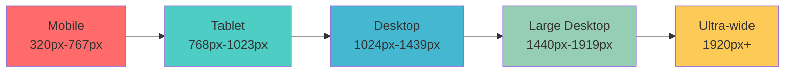
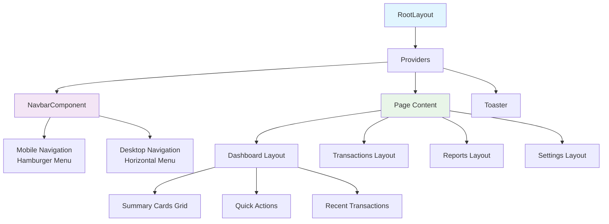
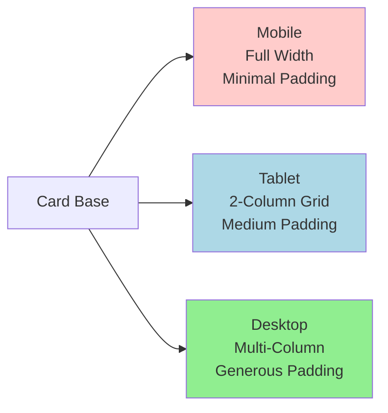
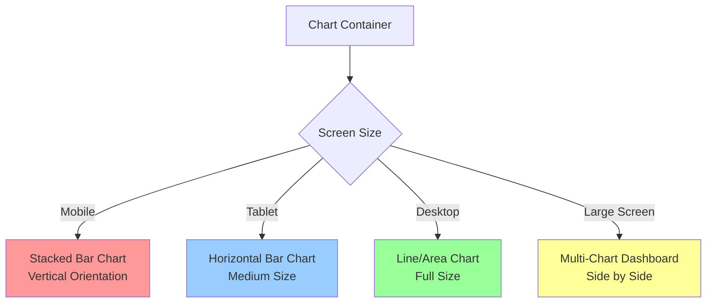
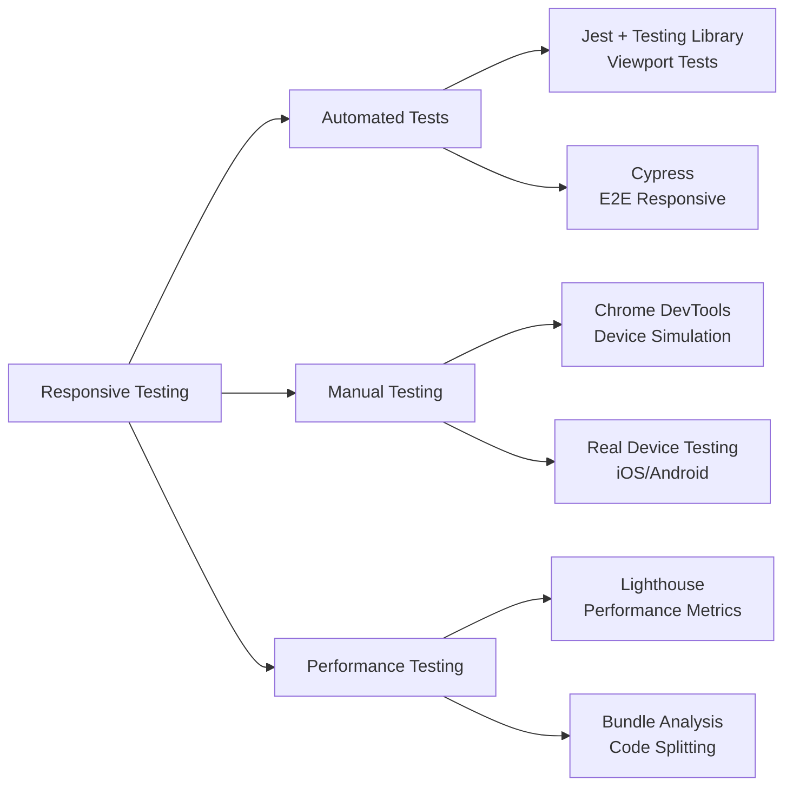

# Mobile-Responsive Design for Expense Buddy AI

## Overview

This design document outlines the mobile-responsive strategy for the Expense Buddy AI application, ensuring optimal user experience across all device sizes from mobile phones (320px) to large displays (up to 43-inch screens). The design leverages Tailwind CSS breakpoints, HeroUI components, and React hooks to create adaptive layouts that scale seamlessly across different screen sizes.

## Technology Stack & Dependencies

### Core Technologies
- **Next.js 14** with App Router
- **React 18** with Server and Client Components
- **Tailwind CSS** for responsive styling
- **HeroUI (NextUI)** for component library
- **GeistSans** font family
- **Lucide React** for icons

### Responsive Framework
- **Tailwind CSS Breakpoint System**
- **CSS Grid and Flexbox** for layout
- **Container Queries** for component-level responsiveness
- **Custom React Hooks** for device detection

## Responsive Breakpoint Strategy

### Breakpoint Definition



### Tailwind Breakpoints Configuration

| Breakpoint | Min Width | Target Devices | Layout Strategy |
|------------|-----------|---------------|-----------------|
| `sm` | 640px | Large Mobile | Single column with stacked components |
| `md` | 768px | Tablet | Two-column grid for cards, horizontal navigation |
| `lg` | 1024px | Desktop | Three-column grid, sidebar navigation |
| `xl` | 1280px | Large Desktop | Four-column grid, extended content areas |
| `2xl` | 1536px | Ultra-wide | Multi-column layouts, dashboard widgets |

## Component Architecture

### Layout Hierarchy



### Responsive Navigation Component

The navigation system adapts based on screen size:

**Mobile Navigation (< 768px)**
- Collapsible hamburger menu
- Full-screen overlay navigation
- Touch-friendly tap targets (44px minimum)
- Vertical menu items with proper spacing

**Desktop Navigation (≥ 768px)**
- Horizontal navigation bar
- Dropdown menus for sub-navigation
- Hover states and keyboard navigation

## Page-Level Responsive Patterns

### Dashboard Page Layout

```mermaid
graph TD
    subgraph "Mobile Layout (sm)"
        A1[Header] --> A2[Summary Cards<br/>Stacked 1x4]
        A2 --> A3[Quick Actions<br/>2x2 Grid]
        A3 --> A4[Upcoming Payments<br/>Full Width]
        A4 --> A5[Recent Transactions<br/>List View]
    end
    
    subgraph "Tablet Layout (md)"
        B1[Header] --> B2[Summary Cards<br/>2x2 Grid]
        B2 --> B3[Quick Actions + Upcoming<br/>Side by Side]
        B3 --> B4[Recent Transactions<br/>Table View]
    end
    
    subgraph "Desktop Layout (lg+)"
        C1[Header + Filters] --> C2[Summary Cards<br/>4x1 Grid]
        C2 --> C3[Quick Actions + Upcoming + Chart<br/>3-Column Layout]
        C3 --> C4[Recent Transactions<br/>Full Table]
    end
```



### Grid System Implementation

**Mobile (sm)**
```css
.dashboard-grid {
  @apply grid grid-cols-1 gap-4 p-4;
}
```

**Tablet (md)**
```css
.dashboard-grid {
  @apply md:grid-cols-2 md:gap-6 md:p-6;
}
```

**Desktop (lg+)**
```css
.dashboard-grid {
  @apply lg:grid-cols-3 xl:grid-cols-4 lg:gap-8 lg:p-8;
}
```

## Component-Level Responsive Design

### Card Components



**Card Responsive Classes**
```tsx
const cardClasses = cn(
  "w-full p-4",           // Base mobile
  "md:p-6",               // Tablet padding
  "lg:p-8",               // Desktop padding
  "xl:min-h-[200px]"      // Large screen minimum height
)
```

### Table Components

**Mobile Strategy**: Convert tables to card layouts
```tsx
// Mobile: Stack as cards
<div className="block md:hidden">
  {transactions.map(transaction => (
    <TransactionCard key={transaction.id} {...transaction} />
  ))}
</div>

// Desktop: Traditional table
<div className="hidden md:block">
  <Table>
    <TableHeader>...</TableHeader>
    <TableBody>...</TableBody>
  </Table>
</div>
```

### Form Components

**Responsive Form Layout**
```tsx
const formClasses = cn(
  "grid gap-4",              // Base mobile
  "md:grid-cols-2 md:gap-6", // Tablet: 2-column
  "lg:grid-cols-3 lg:gap-8"  // Desktop: 3-column
)
```

## Navigation Responsive Patterns

### Mobile Navigation Implementation

```tsx
export function MobileNavigation() {
  const [isOpen, setIsOpen] = useState(false)
  
  return (
    <div className="md:hidden">
      <Button
        variant="ghost"
        size="icon"
        onClick={() => setIsOpen(!isOpen)}
        className="h-10 w-10"
      >
        <Menu className="h-6 w-6" />
      </Button>
      
      {isOpen && (
        <div className="absolute inset-x-0 top-16 z-50 bg-background border-b">
          <nav className="flex flex-col p-4 space-y-4">
            <Link href="/dashboard">Dashboard</Link>
            <Link href="/transactions">Transactions</Link>
            <Link href="/budgets">Budgets</Link>
            <Link href="/reports">Reports</Link>
            <Link href="/friends">Friends</Link>
            <Link href="/settings">Settings</Link>
          </nav>
        </div>
      )}
    </div>
  )
}
```

### Desktop Navigation

```tsx
export function DesktopNavigation() {
  return (
    <nav className="hidden md:flex items-center space-x-6">
      <NavigationMenu>
        <NavigationMenuList>
          <NavigationMenuItem>
            <Link href="/dashboard">Dashboard</Link>
          </NavigationMenuItem>
          {/* Additional menu items */}
        </NavigationMenuList>
      </NavigationMenu>
    </nav>
  )
}
```

## Device-Specific Optimizations

### Touch Interface Optimizations (Mobile/Tablet)

**Minimum Touch Targets**
```css
.touch-target {
  @apply min-h-[44px] min-w-[44px] p-2;
}
```

**Gesture Support**
```tsx
// Swipe gestures for transaction cards
const handleSwipe = useSwipeGesture({
  onSwipeLeft: () => editTransaction(),
  onSwipeRight: () => deleteTransaction()
})
```

### Large Screen Optimizations (1440px+)

**Content Max-Width Strategy**
```tsx
const containerClasses = cn(
  "w-full mx-auto px-4",
  "md:px-6",
  "lg:px-8",
  "xl:max-w-7xl",         // Limit width on very large screens
  "2xl:max-w-[1400px]"    // Ultra-wide constraint
)
```

**Multi-Column Dashboard Layout**
```tsx
// Ultra-wide layout for large screens
<div className="2xl:grid-cols-5 2xl:gap-12">
  <div className="2xl:col-span-3">
    <MainContent />
  </div>
  <div className="2xl:col-span-2">
    <SidebarWidgets />
  </div>
</div>
```

## Data Visualization Responsive Strategy

### Chart Responsiveness



**Chart Responsive Implementation**
```tsx
export function ResponsiveChart({ data }: ChartProps) {
  const isMobile = useIsMobile()
  const isTablet = useMediaQuery('(min-width: 768px) and (max-width: 1023px)')
  
  if (isMobile) {
    return <MobileChart data={data} orientation="vertical" />
  }
  
  if (isTablet) {
    return <TabletChart data={data} height={300} />
  }
  
  return <DesktopChart data={data} height={400} interactive />
}
```

## Typography and Spacing Scale

### Responsive Typography

```css
/* Base mobile typography */
.heading-1 { @apply text-2xl font-bold; }
.heading-2 { @apply text-xl font-semibold; }
.body-text { @apply text-sm; }

/* Tablet scaling */
@screen md {
  .heading-1 { @apply text-3xl; }
  .heading-2 { @apply text-2xl; }
  .body-text { @apply text-base; }
}

/* Desktop scaling */
@screen lg {
  .heading-1 { @apply text-4xl; }
  .heading-2 { @apply text-3xl; }
  .body-text { @apply text-lg; }
}

/* Large screen scaling */
@screen 2xl {
  .heading-1 { @apply text-5xl; }
  .heading-2 { @apply text-4xl; }
}
```

### Spacing Scale

| Element | Mobile | Tablet | Desktop | Large Screen |
|---------|--------|--------|---------|--------------|
| Page Padding | 16px | 24px | 32px | 48px |
| Card Padding | 16px | 24px | 32px | 40px |
| Grid Gap | 16px | 24px | 32px | 48px |
| Section Margin | 24px | 32px | 48px | 64px |

## Performance Optimizations

### Image Responsiveness

```tsx
import { NextImage } from 'next/image'

export function ResponsiveImage({ src, alt }: ImageProps) {
  return (
    <NextImage
      src={src}
      alt={alt}
      width={0}
      height={0}
      sizes="(max-width: 768px) 100vw, (max-width: 1200px) 50vw, 33vw"
      className="w-full h-auto"
      priority={false}
    />
  )
}
```

### Conditional Component Loading

```tsx
import { lazy, Suspense } from 'react'

// Lazy load heavy components for mobile
const AdvancedChart = lazy(() => import('./AdvancedChart'))
const MobileChart = lazy(() => import('./MobileChart'))

export function ChartContainer() {
  const isMobile = useIsMobile()
  
  return (
    <Suspense fallback={<ChartSkeleton />}>
      {isMobile ? <MobileChart /> : <AdvancedChart />}
    </Suspense>
  )
}
```

## Testing Strategy

### Responsive Testing Approach



### Viewport Test Cases

```tsx
describe('Responsive Dashboard', () => {
  const viewports = [
    { width: 375, height: 667, name: 'iPhone SE' },
    { width: 768, height: 1024, name: 'iPad' },
    { width: 1440, height: 900, name: 'Desktop' },
    { width: 2560, height: 1440, name: 'Large Monitor' }
  ]
  
  viewports.forEach(viewport => {
    test(`renders correctly on ${viewport.name}`, () => {
      cy.viewport(viewport.width, viewport.height)
      cy.visit('/dashboard')
      cy.get('[data-testid="dashboard-grid"]').should('be.visible')
      // Additional responsive assertions
    })
  })
})
```

## Implementation Guidelines

### Development Workflow

1. **Mobile-First Approach**
   - Start with mobile layout design
   - Progressively enhance for larger screens
   - Use `min-width` media queries

2. **Component Development**
   - Create responsive variants for each component
   - Test across all breakpoints during development
   - Use design tokens for consistent spacing

3. **Testing Protocol**
   - Test on real devices regularly
   - Use browser dev tools for quick iteration
   - Validate touch interactions on mobile

### Code Organization

```
src/
├── components/
│   ├── ui/
│   │   ├── responsive/          # Responsive utility components
│   │   └── adaptive/            # Device-specific components
│   ├── layouts/
│   │   ├── mobile-layout.tsx
│   │   ├── tablet-layout.tsx
│   │   └── desktop-layout.tsx
├── hooks/
│   ├── use-mobile.tsx           # Mobile detection hook
│   ├── use-media-query.ts       # Generic media query hook
│   └── use-viewport.ts          # Viewport size hook
└── styles/
    ├── responsive.css           # Responsive utility classes
    └── breakpoints.css          # Custom breakpoint definitions
```

This comprehensive responsive design ensures that the Expense Buddy AI application provides an optimal user experience across all device sizes, from mobile phones to large displays up to 43 inches, with adaptive layouts, touch-friendly interfaces, and performance optimizations for each screen category.