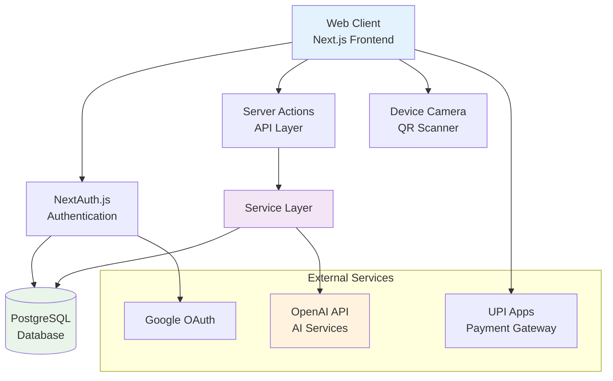
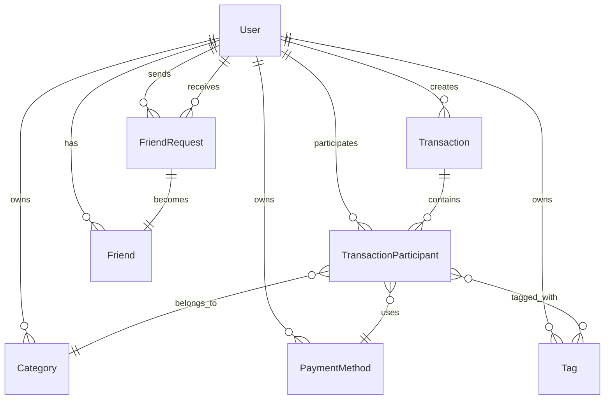
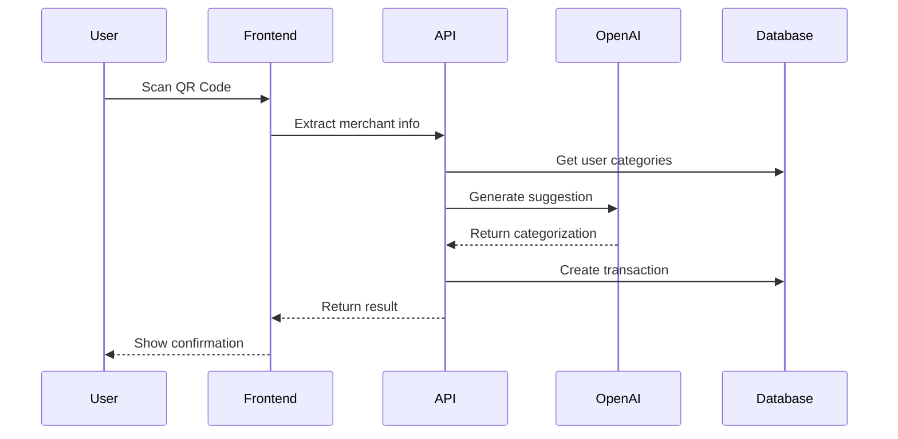
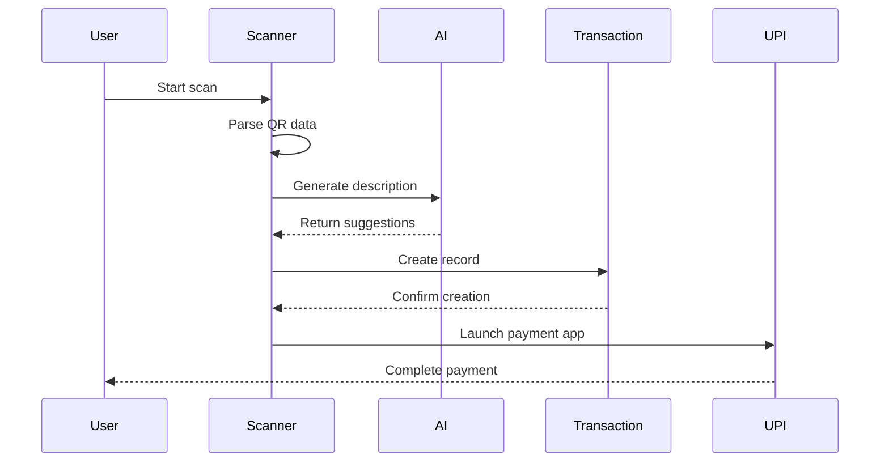
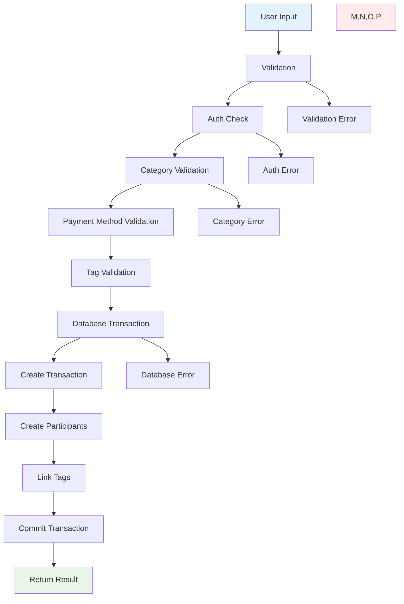

# System Architecture

This document outlines the technical architecture and design patterns used in Expense Buddy AI.

## Table of Contents

- [High-Level Architecture](#high-level-architecture)
- [Technology Stack](#technology-stack)
- [Database Design](#database-design)
- [Authentication System](#authentication-system)
- [Service Layer](#service-layer)
- [Frontend Architecture](#frontend-architecture)
- [AI Integration](#ai-integration)
- [Data Flow](#data-flow)
- [Security Model](#security-model)

## High-Level Architecture



## Technology Stack

### Core Framework
- **Next.js 15** - React framework with App Router
- **React 19** - UI library with concurrent features
- **TypeScript** - Type-safe development
- **Tailwind CSS** - Utility-first styling

### Database & ORM
- **PostgreSQL** - Primary database
- **Prisma** - Type-safe ORM with migrations
- **Connection Pooling** - Vercel Postgres integration

### Authentication
- **NextAuth.js v5** - Authentication framework
- **JWT Strategy** - Stateless session management
- **Google OAuth** - Primary authentication provider

### UI Libraries
- **HeroUI** - Primary component library
- **shadcn/ui** - Secondary components (dashboard)
- **Lucide React** - Icon library
- **Framer Motion** - Animation library

### AI & External APIs
- **OpenAI API** - GPT-3.5-turbo for categorization
- **QR Scanner** - @yudiel/react-qr-scanner
- **UPI Integration** - Custom implementation

## Database Design

### Core Entities



### Key Design Principles

#### Transaction Architecture
- **Transactions** are containers with `totalAmount` and metadata
- **TransactionParticipants** hold individual user entries with amounts, categories, payment methods
- This allows for complex split scenarios while maintaining data integrity

#### User Scoping
- All entities are scoped to users (except authentication tables)
- Foreign key relationships enforce data isolation
- Soft deletes with `isDeleted` flags for audit trails

#### Flexible Categorization
- Categories are type-specific (INCOME/EXPENSE)
- Tags provide additional labeling flexibility
- Both categories and tags are user-owned

### Schema Highlights

```sql
-- Transaction container
CREATE TABLE Transaction (
  id UUID PRIMARY KEY,
  description VARCHAR NOT NULL,
  totalAmount DECIMAL(10,2) NOT NULL,
  creatorId UUID REFERENCES User(id),
  date TIMESTAMP NOT NULL
);

-- Individual participant entries
CREATE TABLE TransactionParticipant (
  id UUID PRIMARY KEY,
  transactionId UUID REFERENCES Transaction(id),
  userId UUID REFERENCES User(id),
  amount DECIMAL(10,2) NOT NULL,
  splitAmount DECIMAL(10,2) NOT NULL,
  splitType SplitType DEFAULT 'EQUAL',
  categoryId UUID REFERENCES Category(id),
  paymentMethodId UUID REFERENCES PaymentMethod(id)
);
```

## Authentication System

### NextAuth.js Configuration

```typescript
// src/auth.ts
export const { handlers, signIn, signOut, auth } = NextAuth({
  providers: [Google],
  adapter: PrismaAdapter(db),
  session: { strategy: "jwt" },
  callbacks: {
    session: ({ session, token }) => ({
      ...session,
      user: { ...session.user, id: token.sub }
    })
  }
});
```

### Session Management
- **JWT Strategy** for stateless sessions
- **Server-side validation** in all server actions
- **User ID extraction** from token for database queries

### Security Features
- **CSRF Protection** built into NextAuth
- **Secure Cookies** for session storage
- **OAuth Flow** handled securely by NextAuth

## Service Layer

### Service Architecture

```typescript
// Service pattern example
export const transactionService = {
  create: async (data: CreateTransactionData): Promise<TransactionResult> => {
    const user = await getCurrentUser();
    // Validation, business logic, database operations
  },
  
  list: async (options: PaginationOptions): Promise<ListTransactionsResult> => {
    // Filtering, pagination, data transformation
  }
};
```

### Key Services

#### Transaction Service
- **CRUD Operations** with validation
- **Split Transaction Logic** for expense sharing
- **Scan Transaction Fallbacks** for QR payments
- **Audit Trail Management** with soft deletes

#### AI Service
- **OpenAI Integration** for smart categorization
- **Prompt Engineering** for consistent results
- **Error Handling** with graceful fallbacks
- **Rate Limiting** and cost optimization

#### User Management
- **Authentication Helpers** for session validation
- **User Scoping** for all database operations
- **Permission Checks** for data access

### Data Validation

```typescript
// Validation example
const validateTransactionData = (data: CreateTransactionData) => {
  if (!data.description?.trim()) {
    throw new Error("Description is required");
  }
  
  if (!data.totalAmount || data.totalAmount <= 0) {
    throw new Error("Amount must be positive");
  }
  
  // Additional validations...
};
```

## Frontend Architecture

### App Router Structure

```
src/app/
├── layout.tsx              # Root layout with providers
├── page.tsx                # Landing page
├── dashboard/              # Dashboard pages
├── transactions/           # Transaction management
├── scan/                   # QR scan & pay
├── reports/                # Analytics
├── settings/               # User preferences
└── api/auth/              # NextAuth API routes
```

### Component Organization

```
src/components/
├── ui/                     # shadcn/ui components
├── layout/                 # Layout components (Navbar, etc.)
├── scan/                   # Scan-specific components
├── dashboard/              # Dashboard components
└── [feature]/              # Feature-specific components
```

### State Management
- **Server State** via server actions and components
- **Client State** with React useState/useReducer
- **Form State** with react-hook-form where needed
- **Global State** through React Context (minimal usage)

### UI Component Strategy
- **HeroUI** as primary design system
- **shadcn/ui** for specific dashboard components
- **Consistent Theming** across both libraries
- **Responsive Design** with mobile-first approach

## AI Integration

### OpenAI Service Architecture



### Prompt Engineering
- **Structured Prompts** for consistent outputs
- **Context Injection** with available categories
- **Output Formatting** as JSON for reliability
- **Confidence Scoring** for suggestion quality

### Cost Optimization
- **Model Selection** (GPT-3.5-turbo for cost efficiency)
- **Prompt Optimization** to reduce token usage  
- **Caching Strategy** for similar requests
- **Fallback Handling** when AI unavailable

## Data Flow

### QR Scan Payment Flow



### Transaction Creation Flow



## Security Model

### Authentication & Authorization
- **JWT-based Sessions** for stateless authentication
- **User-scoped Resources** - all data belongs to authenticated user
- **Service-level Authorization** in every server action
- **No Client-side Secrets** - all sensitive operations server-side

### Data Protection
- **Input Validation** on all user inputs
- **SQL Injection Protection** via Prisma ORM
- **XSS Protection** via React's built-in escaping
- **CSRF Protection** via NextAuth and same-origin policy

### API Security
- **Server Actions** instead of REST APIs for better security
- **Environment Variable Management** for API keys
- **Rate Limiting** considerations for AI API usage
- **Error Handling** without information leakage

### Privacy Considerations
- **Camera Access** with explicit user permission
- **Local QR Processing** before server transmission
- **No Payment Data Storage** - payments handled by UPI apps
- **Audit Logs** for sensitive operations

### Production Security
- **HTTPS Enforcement** for all communications
- **Secure Headers** configured in Next.js
- **Database Connection Security** with connection pooling
- **Monitoring & Logging** for security events

## Scalability Considerations

### Database Optimization
- **Proper Indexing** on frequently queried fields
- **Connection Pooling** for database efficiency
- **Pagination** for large data sets
- **Soft Deletes** to maintain referential integrity

### Performance Optimization
- **Server Components** for reduced client-side JavaScript
- **Image Optimization** via Next.js built-in features
- **Code Splitting** for reduced bundle sizes
- **Caching Strategy** for static content

### Future Scaling
- **Microservice Ready** - services are modular
- **Database Sharding** potential via user ID
- **CDN Integration** for static assets
- **Horizontal Scaling** via serverless deployment

This architecture provides a solid foundation for a secure, scalable expense tracking application with modern web technologies and AI integration.