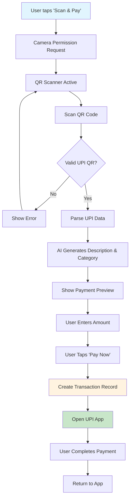

# Scan & Pay Feature Documentation

The Scan & Pay feature allows users to scan UPI QR codes, automatically extract payment information, and complete transactions with AI-powered expense categorization.

## Table of Contents

- [Overview](#overview)
- [User Flow](#user-flow)
- [Technical Architecture](#technical-architecture)
- [Components](#components)
- [API Integration](#api-integration)
- [Configuration](#configuration)
- [Usage Examples](#usage-examples)
- [Troubleshooting](#troubleshooting)

## Overview

The Scan & Pay feature provides a seamless way to:
- Scan UPI payment QR codes using device camera
- Extract merchant information and payment details
- Generate AI-powered transaction descriptions and categories
- Complete payments through various UPI apps
- Automatically create transaction records

### Key Features

- **QR Code Scanning**: Camera-based QR code detection with permission handling
- **UPI Integration**: Support for all major UPI apps (Google Pay, PhonePe, Paytm, BHIM, Amazon Pay)
- **AI Categorization**: OpenAI-powered transaction description and category suggestions
- **Multi-Platform Support**: Works on both Android and iOS devices
- **Fallback Handling**: Automatic creation of default payment methods and categories
- **Real-time Preview**: Live preview of transaction details before payment

## User Flow



## Technical Architecture

### File Structure
```
src/
├── app/scan/
│   └── page.tsx                 # Main scan page
├── components/scan/
│   ├── qr-scanner.tsx          # QR code scanner component
│   ├── upi-handler.tsx         # UPI data parsing and app launching
│   └── payment-preview.tsx     # Payment details and preview
└── server/services/
    ├── aiService.ts            # OpenAI integration
    └── transactionService.ts   # Transaction creation with scan fallbacks
```

### Data Flow

1. **QR Scanning**: Camera captures QR code → Parse UPI URL format
2. **AI Processing**: Extract merchant info → Generate smart description/category
3. **Transaction Creation**: Validate data → Create transaction record
4. **Payment Launch**: Generate UPI URL → Open payment app

## Components

### QRScannerComponent (`/components/scan/qr-scanner.tsx`)

Handles camera access and QR code detection.

**Props:**
- `onScanResult: (data: string) => void` - Callback when QR code detected
- `onError: (error: string) => void` - Error handling callback
- `isActive: boolean` - Scanner active state
- `onToggle: () => void` - Toggle scanner on/off

**Features:**
- Camera permission handling
- Error state management
- Visual scanning overlay
- Retry mechanism

```typescript
<QRScannerComponent
  onScanResult={handleScanResult}
  onError={handleScanError}
  isActive={isScanning}
  onToggle={() => setIsScanning(!isScanning)}
/>
```

### UPI Handler (`/components/scan/upi-handler.tsx`)

Parses UPI QR data and manages payment app integration.

**Key Functions:**
- `parseUPIData(qrData: string)` - Extract UPI parameters from QR code
- `generateUPIURL(upiData: UPIData, amount: number)` - Create payment URL
- `openUPIApp(upiUrl: string, appScheme?: string)` - Launch payment app

**UPI Data Structure:**
```typescript
interface UPIData {
  pa?: string;  // Payee address (UPI ID)
  pn?: string;  // Payee name
  am?: string;  // Amount
  cu?: string;  // Currency
  tn?: string;  // Transaction note
  tr?: string;  // Transaction reference
  mc?: string;  // Merchant code
}
```

### Payment Preview (`/components/scan/payment-preview.tsx`)

Displays payment details and handles user interaction.

**Features:**
- Merchant information display
- Amount input with validation
- AI-generated suggestions
- UPI app selection
- Payment initiation

## API Integration

### AI Service (`/server/services/aiService.ts`)

Provides intelligent transaction categorization using OpenAI GPT-3.5-turbo.

#### `generateTransactionSuggestion()`
```typescript
async function generateTransactionSuggestion(
  merchantName: string,
  upiId: string,
  amount: number
): Promise<TransactionSuggestion>
```

**Returns:**
```typescript
interface TransactionSuggestion {
  description: string;      // Generated description
  categoryId: string | null; // Matched category ID
  categoryName: string | null; // Category name
  confidence: number;       // Confidence score (0-1)
}
```

#### `enhanceTransactionDescription()`
```typescript
async function enhanceTransactionDescription(
  originalDescription: string,
  merchantName: string,
  amount: number
): Promise<string>
```

### Transaction Service

#### `createScanTransaction()`
Specialized transaction creation for scan payments with automatic fallbacks.

**Features:**
- Auto-creates UPI payment method if missing
- Auto-creates "General" expense category if needed
- Handles missing category/payment method gracefully

```typescript
const response = await createScanTransaction({
  description: "AI-generated description",
  totalAmount: amount,
  date: new Date().toISOString(),
  notes: `UPI Payment to ${upiData.pa}`,
  participants: [{
    userId: user.id,
    amount: amount,
    type: 'EXPENSE',
    categoryId: categoryId || '', // Auto-filled
    paymentMethodId: '',          // Auto-filled
    description: "UPI Payment via QR scan",
    tagIds: []
  }]
});
```

## Configuration

### Environment Variables

Add to your `.env` file:

```env
# OpenAI API for AI-powered transaction categorization
OPENAI_API_KEY="your-openai-api-key-here"
```

### Dependencies

Required packages:
```json
{
  "@yudiel/react-qr-scanner": "^2.3.1",
  "openai": "^5.16.0"
}
```

Install with:
```bash
bun add @yudiel/react-qr-scanner openai
```

## Usage Examples

### Basic QR Scanning Flow

```typescript
// 1. Scan QR Code
const handleScanResult = (qrData: string) => {
  const upiData = parseUPIData(qrData);
  if (upiData) {
    setPaymentData(upiData);
  }
};

// 2. Get AI Suggestions
const aiSuggestion = await generateTransactionSuggestion(
  upiData.pn,     // "Starbucks Coffee"
  upiData.pa,     // "starbucks@icici"
  amount          // 250
);
// Returns: { description: "Coffee at Starbucks", categoryId: "food-id", confidence: 0.9 }

// 3. Create Transaction
const transactionData = {
  description: aiSuggestion.description,
  totalAmount: amount,
  participants: [{ /* ... */ }]
};
const result = await createScanTransaction(transactionData);
```

### UPI URL Generation

```typescript
const upiData = {
  pa: "merchant@bank",
  pn: "Merchant Name",
  cu: "INR"
};

// Generate payment URL
const upiUrl = generateUPIURL(upiData, 500);
// Result: "upi://pay?pa=merchant@bank&pn=Merchant%20Name&am=500&cu=INR"

// Launch specific app
openUPIApp(upiUrl, "tez://"); // Google Pay
openUPIApp(upiUrl, "phonepe://"); // PhonePe
```

### Error Handling

```typescript
const handleScanError = (error: string) => {
  switch (true) {
    case error.includes('Permission denied'):
      // Guide user to enable camera permissions
      break;
    case error.includes('No camera found'):
      // Show alternative input method
      break;
    default:
      // Generic error handling
  }
};
```

## Navigation Integration

### Navbar Link
The scan feature is accessible via the main navigation:
```typescript
// src/components/layout/Navbar.tsx
<NavbarItem>
  <Link color="foreground" href="/scan">
    Scan & Pay
  </Link>
</NavbarItem>
```

### Dashboard Quick Action
Available as a quick action button:
```typescript
// src/app/dashboard/quick-actions.tsx
<Button onClick={() => router.push('/scan')}>
  <QrCode className="h-4 w-4" />
  Scan & Pay
</Button>
```

## Browser Compatibility

### Camera Requirements
- **HTTPS Required**: Camera access only works on HTTPS or localhost
- **Supported Browsers**: Chrome 53+, Firefox 36+, Safari 11+, Edge 12+
- **Mobile Support**: iOS Safari 11+, Chrome Mobile 53+

### UPI App Detection
- **Android**: Direct app launching via custom schemes
- **iOS**: Limited to installed apps with registered URL schemes
- **Web**: Fallback to generic UPI URLs

## Troubleshooting

### Common Issues

#### Camera Not Working
```
Error: "Camera permission denied"
```
**Solution:**
1. Ensure HTTPS connection (required for camera access)
2. Check browser camera permissions
3. Verify device has working camera

#### QR Code Not Scanning
```
Error: "Invalid QR code"
```
**Solution:**
1. Ensure QR code is UPI format (`upi://pay?...`)
2. Check QR code quality and lighting
3. Verify QR code contains required UPI parameters (`pa` field)

#### AI Suggestions Not Working
```
Error: "Failed to generate AI suggestion"
```
**Solution:**
1. Verify `OPENAI_API_KEY` environment variable
2. Check OpenAI API quota/billing
3. Review network connectivity

#### UPI App Not Opening
```
Error: "Failed to open UPI app"
```
**Solution:**
1. Ensure device has UPI apps installed
2. Check if running on supported platform (Android/iOS)
3. Verify UPI URL format is correct

### Debug Mode

Enable detailed logging by adding to your component:
```typescript
const DEBUG = process.env.NODE_ENV === 'development';

if (DEBUG) {
  console.log('QR Data:', qrData);
  console.log('UPI Parsed:', upiData);
  console.log('AI Suggestion:', aiSuggestion);
}
```

### Performance Optimization

#### Camera Resource Management
```typescript
// Properly cleanup camera resources
useEffect(() => {
  return () => {
    // Scanner cleanup handled automatically
  };
}, []);
```

#### AI Request Caching
The AI service includes built-in caching for similar merchant requests to reduce API calls.

## Security Considerations

### Data Privacy
- Camera access requires explicit user permission
- QR data is processed locally before transmission
- No payment credentials are stored locally

### API Security
- OpenAI API key stored securely in environment variables
- All API calls made from server-side actions
- Transaction data validated before database storage

### UPI Security
- No sensitive payment data intercepted
- Users complete payments in official UPI apps
- Transaction records created with minimal required data

## Testing

### Manual Testing Checklist
- [ ] Camera permission request works
- [ ] QR code scanning detects valid UPI codes
- [ ] Invalid QR codes show appropriate errors
- [ ] AI suggestions generate for merchant data
- [ ] Payment preview shows correct information
- [ ] UPI app launching works on target devices
- [ ] Transaction records created successfully
- [ ] Error states handled gracefully

### Test QR Codes
For testing, you can generate UPI QR codes at:
- [QR Code Generator](https://www.qrcodechimp.com/qr-code-generator-for-upi)
- Manual UPI URL: `upi://pay?pa=test@upi&pn=Test%20Merchant&am=100&cu=INR`

## Future Enhancements

### Planned Features
- [ ] Receipt OCR scanning
- [ ] Bulk QR code processing
- [ ] Payment history integration
- [ ] Custom AI model fine-tuning
- [ ] Offline QR code parsing
- [ ] Multi-currency support

### API Extensions
- [ ] Webhook support for payment confirmation
- [ ] Bulk transaction import
- [ ] Advanced AI categorization rules
- [ ] Integration with bank APIs

---

For technical support or feature requests, please refer to the main project documentation or create an issue in the repository.